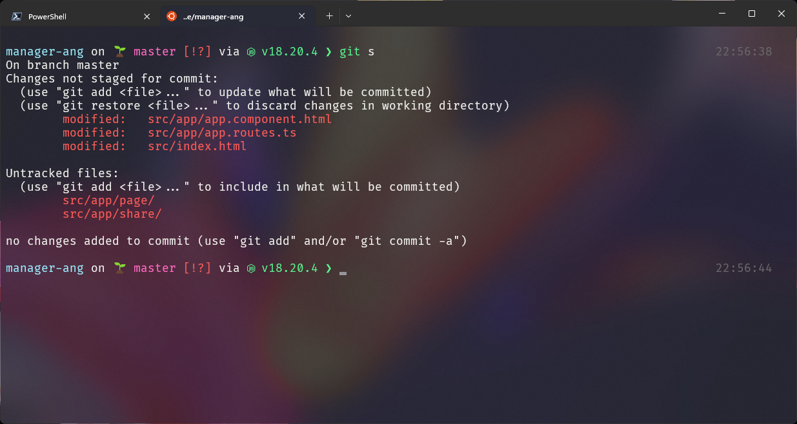

# Prompt (Starship)

Starship es un prompt cross-shell (https://starship.rs/guide/) común a Linux, macOS y Windows. La misma configuración sirve en los tres SO.

## Configuración (`~/.config/starship.toml`)

```toml
right_format = "$time"

[time]
disabled = false
style = "bold bright-black"
format = "[$time]($style)"

[line_break]
disabled = true

[git_branch]
symbol = '🌱 '
truncation_symbol = ''
```

El archivo real versionado está en [home/.config/starship.toml](home/.config/starship.toml) y se enlaza a `~/.config/starship.toml` mediante Stow.



## Instalación por SO
- Linux: [linux/install.md](linux/install.md)
- macOS: [macos/install.md](macos/install.md)
- Windows: [windows/install.md](windows/install.md)