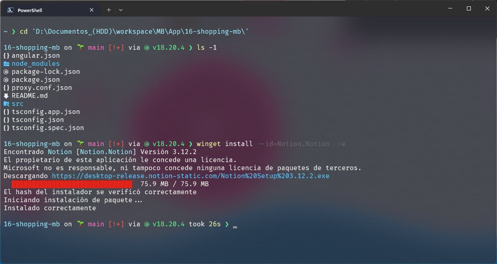

# Windows


## Recursos
Paginas para descargar e istalar desde la terminal
- [winstall](https://winstall.app/)

- [winget-run](https://winget.run/)


## Instalar Terminal

- Windows Terminal: Multiples terminales

```bash
  winget install WindowsTerminal
```

- PowerShell : Terminal actualizada de windows

```bash
  winget install PowerShell
```

## Temas para la terminal -> [Temas](./themes.md)


## Starship Promt


```bash
  winget install starship
```

**Para cmd se necesita Clink**

```bash
  winget install clink
```
## Zoxide
```bash
   winget install zoxide
```
Variables de entorno widows por si no lo coloca e automatico
```bash
  C:\Users\usuario\AppData\Local\Microsoft\WinGet\Packages\ajeetdsouza.zoxide_Microsoft.Winget.Source_8wekyb3d8bbwe
```

## LS Delux
```bash
  winget install lsd
```

## Neo Vim
```bash
  winget install Neovim
```

## NVM
```bash
  winget install --id=CoreyButler.NVMforWindows
```


